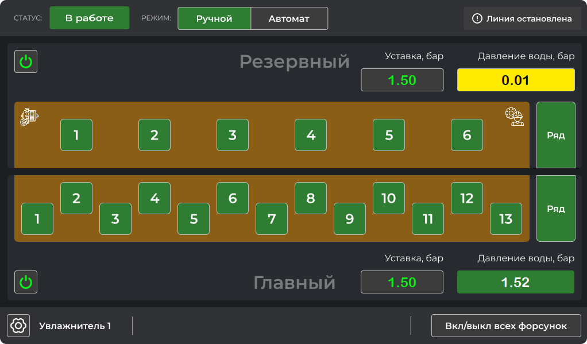
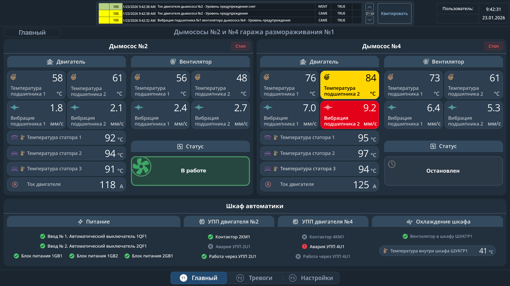

# Демонстрационные проекты

### Интерфейс установки увлажнения продукции на базе Weintek

---

### Интерфейс SCADA КАСКАД для агрегатов дымоудаления

---

### Файлы проектов `.psl` написаны для контроллеров Segnetics:

* `Станок_ПМА-4.psl` - реализован на ПЛК SMH4 с подключенной периферией:
  * ModbusTCP - модуль ввода вывода GCAN/Moxa на ~110 каналов;
  * MRbus - модули в/вв FMR и MRL;
  * ModbusRTU - диагностика и настройка частотных преобразователей;

* `Станок_РПА-4.psl` - реализован на ПЛК Matrix с подключенной периферией:
  * MRbus - модули в/вв MRL;
  * ModbusRTU - диагностика и настройка частотных преобразователей;

* `Котельная.psl` - в/вв на базе FMR, получение сигналов с датчиков и управление 3-ходовыми клапанами.
